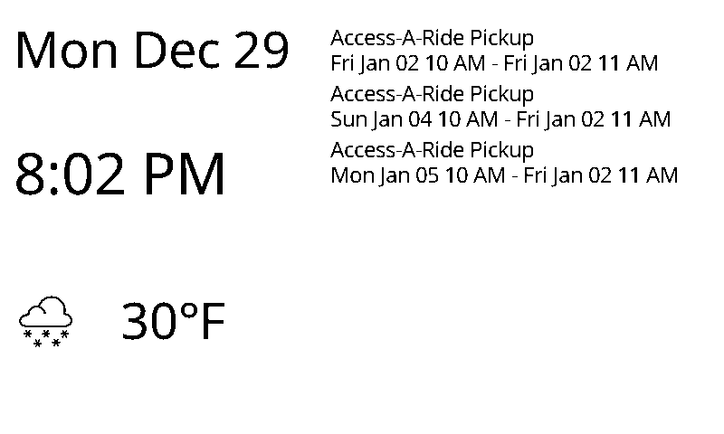

# Calendar Display
This is a small program I made to show a display with some basic info (date, time, weather, upcoming calendar events) on an e-ink display that I have mounted on my wall with a 3d printed frame.
My code assumes [this exact display](https://www.waveshare.com/7.5inch-e-paper-hat.htm) and a raspberry pi.

## Example display
This image can be regenerated using `cargo test`

## Set up
The binary can be built with a simple `cargo build`, but I found this annoying to do directly on my raspberry pi zero, so instead I've been cross compiling a completely static binary using `nix build`.

The `nix build` results in 1 statically linked binary that includes everything the program needs, including inbuilt fonts (created from Google's Noto Fonts). Then I have 2 systemd user services, one that launches the program and one that periodically sends it a SIGUSR1 which triggers a refresh.

### On the build machine
The first build will take a bit if you haven't cross compiled with nix before since it will need time to download libraries.
1. `cp $(nix build --no-link --print-out-paths)/bin/calendar-display calendar-display/calendar-display`
2. `cp calendar-display/env.example calendar-display/env`
3. Fill in all the environment variables in `calendar-display/env`
4. Copy the whole `calendar-display` folder to `~/calendar-display` on your raspberry pi `rsync -avP /path/to/calendar-display/ USER@raspberrypi:calendar-display/`

### On the raspberry pi
If you don't have spi enabled on your raspberry pi then first run `sudo raspi-config nonint do_spi 0 && sudo reboot` to enable spi
1. `cd ~/calendar-display`
2. `./install.sh`
